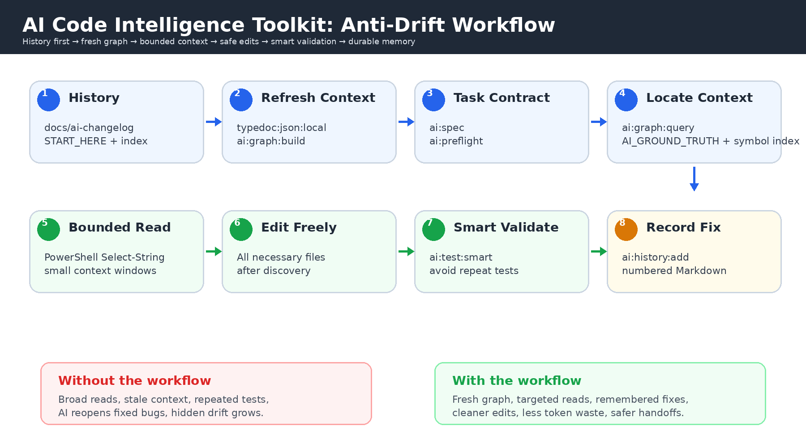
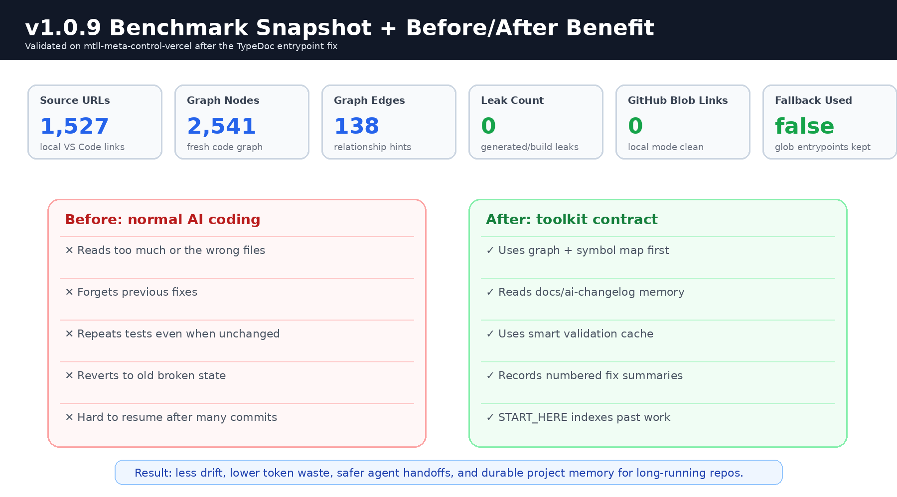

# AI Code Intelligence Toolkit

**Anti-drift code intelligence for AI-assisted development.**

AI Code Intelligence Toolkit gives coding agents a repeatable operating system for large repositories: fresh local TypeDoc context, a lightweight code graph, bounded PowerShell reads, smart validation memory, and durable numbered changelog entries. It is designed for practical agent work where the biggest risks are stale context, repeated tests, broad file dumps, forgotten fixes, and agents accidentally reverting old bugs.



## Why this exists

AI coding agents are useful, but on real projects they can drift:

- They read broad files instead of exact context.
- They use stale assumptions from earlier runs.
- They repeatedly run the same tests even when nothing changed.
- They forget that a bug was already fixed.
- They reopen broken approaches after hundreds or thousands of commits.
- They edit before locating the right files, symbols, and contracts.

This toolkit forces a simple loop:

```powershell
npm run ai:history:status
npm run typedoc:json:local && npm run ai:graph:build
npm run ai:spec -- "<task>"
npm run ai:preflight -- "<task>"
npm run ai:graph:query -- "<specific symbol/file/error/feature>"
```

After the loop completes, the agent may edit every necessary repository file. The workflow is a navigation and anti-drift contract, not an edit whitelist.

## Companion package

Install this with **TypeDoc Hybrid Source Links** for the complete workflow.

- TypeDoc Hybrid Source Links: `typedoc-hybrid-source-links`
- AI Code Intelligence Toolkit: `ai-code-intelligence-toolkit`

```powershell
npm install -D typedoc typedoc-hybrid-source-links@latest ai-code-intelligence-toolkit@latest
npx typedoc-hybrid-install --target . --overwrite
npx ai-code-intel-install --target . --overwrite --strict
npm run ai:history:init
npm run ai:inject-contract
```

## Before vs after



| Problem without toolkit | Behavior with toolkit |
|---|---|
| Agent reads entire files and burns context. | Agent starts with `AI_GROUND_TRUTH.md`, `AI_SYMBOL_INDEX.json`, graph query, and bounded `Select-String`. |
| Agent forgets that a bug was already fixed. | Agent checks `docs/ai-changelog/START_HERE.md` and `history.index.json` first. |
| Agent reruns the same build/test repeatedly. | Agent uses `ai:test:smart` and `ai:test:status` to avoid unchanged repeated validation. |
| Agent treats preflight output as a hard whitelist and refuses necessary edits. | Contract explicitly allows all necessary edits after discovery. |
| Agent drifts after many commits. | Each important fix becomes a numbered Markdown entry with JSON index metadata. |
| TypeDoc local links accidentally point to GitHub blobs. | Local mode validates VS Code links and reports GitHub blob leaks. |

## Validated benchmark snapshot

Latest real-project validation on `mtll-meta-control-vercel` after the v1.0.9 TypeDoc entrypoint fix:

| Metric | Result |
|---|---:|
| TypeDoc local source URLs | `1,527` |
| GitHub blob links in local mode | `0` |
| Graph nodes | `2,541` |
| Graph edges | `138` |
| Graph leak count | `0` |
| TypeDoc entrypoint fallback | `false` |
| Entrypoint strategy | `expand` |
| Preserved globs | `src/**/*.ts`, `src/**/*.tsx`, `api/**/*.ts`, `api/**/*.tsx`, `scripts/**/*.mjs` |

Expected TypeDoc documentation warnings are allowed when internal referenced types are not exported into docs. The blocker is an entrypoint failure, missing generated JSON, GitHub blob links in local mode, missing scripts, graph leaks, or conflict markers.

## What gets installed

```text
AGENTS.md
README.md
AI_GROUND_TRUTH.md
AI_SYMBOL_INDEX.json
scripts/ai/spec-preflight.mjs
scripts/ai/codex-preflight.mjs
scripts/ai/history-worklog.mjs
scripts/ai/test-smart-runner.mjs
scripts/ai/inject-agent-contract.mjs
scripts/graphrag/build-code-graph.mjs
scripts/graphrag/query-code-graph.mjs
scripts/graphrag/doctor.mjs
scripts/graphrag/check-no-leaks.mjs
docs/ai-changelog/START_HERE.md
docs/ai-changelog/history.index.json
mcp/codebase-intelligence-server.mjs
```

It also installs TypeDoc support scripts and templates when used together with `typedoc-hybrid-source-links`.

## Core commands

| Purpose | Command |
|---|---|
| Refresh context | `npm run ai:context:refresh` |
| Task spec | `npm run ai:task:spec -- "<task>"` |
| Task preflight | `npm run ai:task:preflight -- "<task>"` |
| Locate context | `npm run ai:context:find -- "<symbol/file/error>"` |
| Graph doctor | `npm run ai:context:doctor` |
| Leak check | `npm run ai:context:leak-check` |
| Inject contract | `npm run ai:contract:inject` |
| Repair contract | `npm run ai:contract:repair` |
| History status | `npm run ai:history:status` |
| Add history entry | `npm run ai:history:add -- --task "<task>" --summary "<summary>"` |
| Smart validation | `npm run ai:test:smart -- "npm run build"` |
| Validation status | `npm run ai:test:status` |
| Final health | `npm run ai:final-health` |

Compatibility command names still work:

```powershell
npm run ai:spec -- "<task>"
npm run ai:preflight -- "<task>"
npm run ai:graph:query -- "<symbol/file/error>"
npm run ai:graph:doctor
npm run ai:graph:check-leaks
```

## Required anti-drift workflow

Use this before every AI coding task:

```powershell
npm run ai:history:status
npm run typedoc:json:local && npm run ai:graph:build
npm run ai:spec -- "<task>"
npm run ai:preflight -- "<task>"
npm run ai:graph:query -- "<specific symbol/file/error/feature>"
```

Then use targeted context reads. On PowerShell:

```powershell
Select-String -Path "AI_GROUND_TRUTH.md","AI_SYMBOL_INDEX.json","docs/ai-changelog/START_HERE.md" -Pattern "<symbol or file>" -SimpleMatch -Context 4,8
Select-String -Path "<exact-file-from-graph-query>" -Pattern "<specific-symbol-or-phrase>" -SimpleMatch -Context 40,60
```

Do not use broad `Get-Content` dumps or broad `rg` as the first navigation move. Use them only after graph/symbol lookup fails or a task specifically requires repository-wide search.

## Edit permission contract

The toolkit does **not** block editing to files returned by preflight. After the anti-drift workflow completes, the AI coding agent may edit any necessary repository file to complete the task correctly.

Preflight and graph query are guidance tools:

- `suggestedReadFiles` means likely context.
- `suggestedEditFiles` means likely starting points.
- They are not a hard patch whitelist.

Generated files, build outputs, archives, and dependency folders should not be hand-edited unless the task is specifically about generated docs, generated artifacts, or tooling behavior.

## Durable changelog memory

The toolkit creates:

```text
docs/ai-changelog/START_HERE.md
docs/ai-changelog/history.index.json
```

Record important work:

```powershell
npm run ai:history:add -- --task "Fix dashboard overflow" --summary "Adjusted panel constraints and prevented list text clipping." --files "src/App.tsx,src/professional-polish.css" --validation "npm run build"
```

This creates numbered Markdown entries such as:

```text
docs/ai-changelog/001-fix-dashboard-overflow.md
```

The goal is simple: future agents should know what was already fixed and avoid reverting to older broken states.

## Smart validation memory

Run validations through the smart runner:

```powershell
npm run ai:test:smart -- "npm run build"
npm run ai:test:smart -- "npm run test"
npm run ai:test:smart -- "npm run lint"
npm run ai:test:status
```

If the same command already passed against the same repository fingerprint, the tool can skip unnecessary repeated runs. Use `--force` only when an intentional repeat is needed.

## Use-case examples

### UI/layout fix

```powershell
npm run ai:history:status
npm run typedoc:json:local && npm run ai:graph:build
npm run ai:spec -- "Fix dashboard spacing, list overflow, side panel layout, and text clipping"
npm run ai:preflight -- "Fix dashboard spacing, list overflow, side panel layout, and text clipping"
npm run ai:graph:query -- "dashboard layout side panel list view App"
Select-String -Path "AI_GROUND_TRUTH.md","AI_SYMBOL_INDEX.json" -Pattern "dashboard layout" -SimpleMatch -Context 4,8
npm run ai:test:smart -- "npm run build"
npm run ai:history:add -- --task "Fix dashboard layout" --summary "Adjusted spacing, panel sizing, and overflow behavior." --validation "npm run build"
```

### Backend/API fix

```powershell
npm run ai:history:status
npm run typedoc:json:local && npm run ai:graph:build
npm run ai:spec -- "Fix readiness endpoint, webhook validation, and server-side permission checks"
npm run ai:preflight -- "Fix readiness endpoint, webhook validation, and server-side permission checks"
npm run ai:graph:query -- "readiness webhook permissions api"
npm run ai:test:smart -- "npm run test"
npm run ai:history:add -- --task "Fix backend readiness" --summary "Updated readiness and webhook validation paths." --validation "npm run test"
```

### Known symbol or file fix

```powershell
npm run typedoc:json:local && npm run ai:graph:build
npm run ai:spec -- "Fix broken source links for typedoc local mode"
npm run ai:preflight -- "Fix broken source links for typedoc local mode"
npm run ai:graph:query -- "typedoc-source-config sourceLinkTemplate"
Select-String -Path "scripts/typedoc-source-config.mjs" -Pattern "sourceLinkTemplate" -SimpleMatch -Context 40,60
```

## Final health gate

Run before committing agent/tooling changes:

```powershell
npm run typedoc:health
npm run typedoc:json:local
npm run typedoc:check-local
npm run ai:graph:build
npm run ai:graph:doctor
npm run ai:graph:check-leaks
npm run ai:history:status
npm run ai:test:status
```

Or use:

```powershell
npm run ai:final-health
```

## Recommended commit habit

After a successful task:

```powershell
git status
npm run ai:test:smart -- "npm run build"
npm run ai:history:add -- --task "<task>" --summary "<what changed>" --files "<files>" --validation "npm run build"
git add -A
git commit -m "<clear change summary>"
```

## License

MIT
