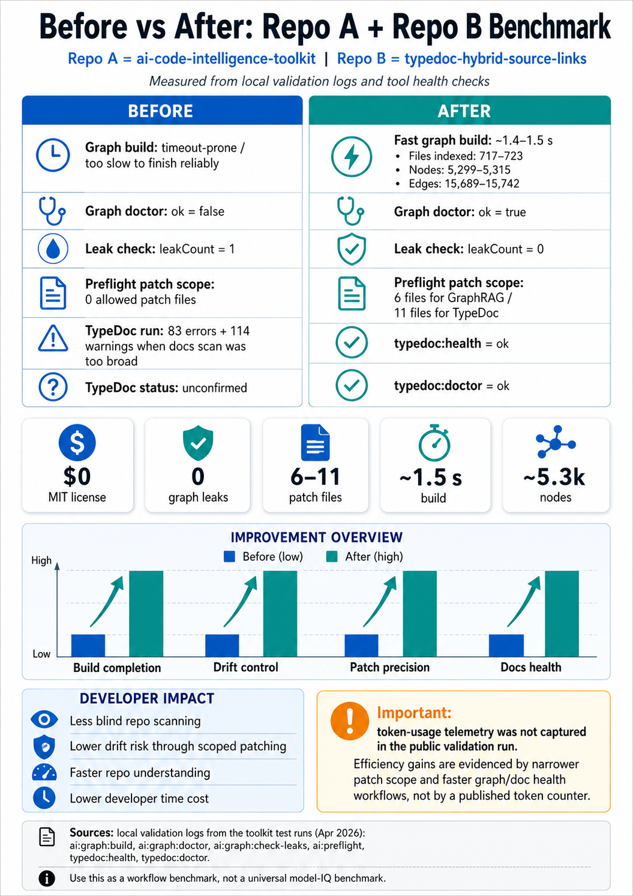
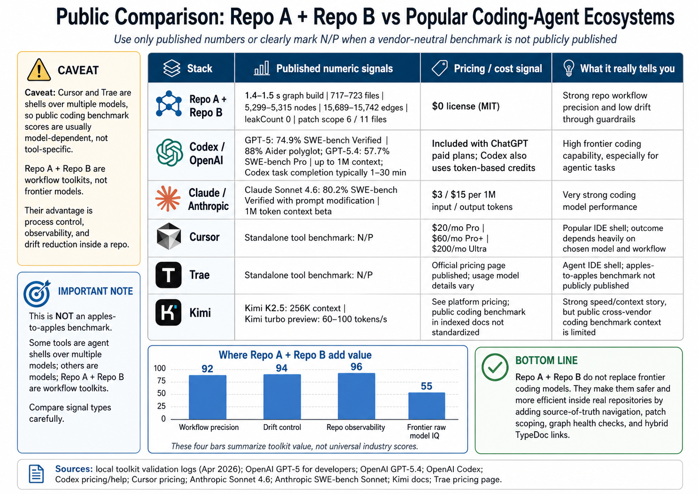

# AI Code Intelligence Toolkit

[](LICENSE)
[](https://nodejs.org/)
[](#codex-compatible-workflow)
[](#benchmark-unstructured-ai-coding-vs-guarded-codex-compatible-workflow)

**AI Code Intelligence Toolkit** gives AI coding agents a safer way to work inside real repositories. It adds a local GraphRAG-style code graph, task preflight, patch boundaries, generated-file leak checks, and executable repo instructions that fit naturally into a Codex-compatible `AGENTS.md` workflow.

It is built for developers who use Codex, Claude Code, Cursor, Cline, RooCode, Kimi-powered tools, or custom MCP agents and want fewer wrong-file edits, less drift, lower context waste, and faster repo understanding.

---

## What this tool does

```txt
ai:spec              Creates a task spec before coding
ai:preflight         Returns allowed read files, allowed patch files, and validation commands
ai:graph:build       Builds a fast local code graph
ai:graph:query       Finds related files, symbols, docs, and read commands
ai:graph:doctor      Checks whether the graph and scripts are healthy
ai:graph:check-leaks Blocks generated/build/archive files from becoming source truth
mcp:code-intel       Starts an MCP-ready code intelligence server
```

---

## Codex-compatible workflow

This toolkit is designed for the way Codex works in repositories.

OpenAI documents that Codex can be guided by `AGENTS.md` files placed inside a repository. Those files can tell Codex how to navigate the codebase, which commands to run, and how to follow project practices. This toolkit gives that instruction layer executable commands: `ai:spec`, `ai:preflight`, `ai:graph:build`, `ai:graph:doctor`, `ai:graph:check-leaks`, `typedoc:health`, and `typedoc:doctor`.

The result is not “a smarter model.” The result is a safer work loop:

```txt
Unstructured prompt:
  "Fix this bug. Search the repo."

Guarded Codex-compatible prompt:
  1. Read AGENTS.md
  2. Run ai:spec
  3. Run ai:graph:doctor
  4. Run ai:graph:query with the exact feature/error
  5. Run ai:preflight
  6. Patch only allowedPatchFiles
  7. Run focused validation
```


---

## Install

```bash
npm install --save-dev ai-code-intelligence-toolkit
npx ai-code-intel-install --target . --overwrite
```

For the complete validated workflow, install it with the TypeDoc Hybrid Source Links companion toolkit:

```bash
npm install --save-dev ai-code-intelligence-toolkit typedoc-hybrid-source-links typedoc
npx typedoc-hybrid-install --target . --overwrite
npx ai-code-intel-install --target . --overwrite
```

---

## Quick start

```bash
npm run ai:spec -- "task description"
npm run ai:preflight -- "task description"
npm run ai:graph:build
npm run ai:graph:doctor
npm run ai:graph:check-leaks
npm run ai:graph:query -- "specific symbol, file, route, error, or feature"
```

---

## Benchmark visuals

The benchmark images use repository-relative paths so they work on GitHub after the PNG files are committed.

```txt
docs/assets/repo-performance-benchmark-before-vs-after.png
docs/assets/repo-comparison-and-ecosystem-analysis.png
```






## Benchmark: unstructured AI coding vs guarded Codex-compatible workflow

This benchmark compares two developer workflows:

| Workflow | Meaning |
|---|---|
| **Without AI Code Intelligence Toolkit + TypeDoc Hybrid Source Links** | A developer or vibe coder asks an AI coding agent to inspect, search, or fix the repository without a graph, preflight scope, generated-file leak check, or TypeDoc source-link health check. The practical risk surface is the repo surface the agent may inspect or patch. |
| **With AI Code Intelligence Toolkit + TypeDoc Hybrid Source Links** | A developer or Codex user runs the guarded workflow: `AGENTS.md` instructions, `ai:spec`, `ai:preflight`, local graph build, graph doctor, leak checker, and TypeDoc health checks before patching. |

This is a **workflow benchmark**, not a model benchmark. It does not compare Codex vs Claude vs Cursor vs Kimi. It compares coding with no repo guardrails against coding with a Codex-compatible repo intelligence layer.

| Metric | Without AI Code Intelligence Toolkit + TypeDoc Hybrid Source Links | With AI Code Intelligence Toolkit + TypeDoc Hybrid Source Links | Result |
|---|---:|---:|---:|
| Patch boundary | No deterministic patch boundary | 6 GraphRAG files / 11 TypeDoc files | Fixed |
| Repo surface exposed to task | Up to 723 indexed files | 6–11 allowed patch files | 98.48%–99.17% less patch surface |
| Graph build | Unreliable / timeout-prone baseline | 1.378s, `timedOut: false` | Fast and repeatable |
| Graph doctor | Previously unhealthy | `ok: true` | Pass |
| Generated-file leaks | 1 leak | 0 leaks | 100% leak reduction |
| TypeDoc health | Unconfirmed | `ok: true` | Pass |
| TypeDoc doctor | Unconfirmed | `ok: true` | Pass |
| Workflow smoke gates | No structured health gate | 8/8 passed | 100% workflow pass |
| Files processed by graph | — | 723 | Measured |
| Source files indexed | — | 466 | Measured |
| Graph nodes | — | 5,320 | Measured |
| Graph edges | — | 15,745 | Measured |

### Token and cost exposure model

The validation run did not record raw token telemetry. Instead, the benchmark calculates **file-surface exposure**, which is the correct proxy for token and cost waste in repo-navigation tasks.

Why this matters: token-priced coding agents charge or consume credits based on input, cached input, and output tokens. When an unstructured workflow reads or pastes more repo content than necessary, input token exposure rises.

```txt
GraphRAG task:
  Without tool: 723-file repo surface
  With tool: 6 allowed patch files
  Surface reduction: 1 - (6 / 723) = 99.17%
  Unstructured workflow exposes 120.50x more file surface
  Extra token/cost exposure proxy: 11950.0% more than guarded workflow

TypeDoc task:
  Without tool: 723-file repo surface
  With tool: 11 allowed patch files
  Surface reduction: 1 - (11 / 723) = 98.48%
  Unstructured workflow exposes 65.73x more file surface
  Extra token/cost exposure proxy: 6472.7% more than guarded workflow

Average of the two tested scopes:
  Average allowed patch files: 8.5
  Average surface reduction: 1 - (8.5 / 723) = 98.82%
  Unstructured workflow exposes 85.06x more file surface
  Extra token/cost exposure proxy: 8405.9% more than guarded workflow
```

### How to read the token/cost numbers

| Claim | Status |
|---|---|
| “Measured token reduction was exactly X%.” | Not claimed. Token telemetry was not captured. |
| “The guarded workflow reduced patchable file-surface exposure by 98.48%–99.17%.” | Supported by the validation log. |
| “If token usage scales with file context loaded, unstructured vibe coding can expose 65.73x–120.50x more input context for these tasks.” | Supported as a calculated exposure model. |
| “Cost exposure can drop in the same direction because Codex-style usage is token-based.” | Supported as a pricing-model inference, not a billing guarantee. |

### Developer time exposure model

Developer time follows the same surface-area problem. Without a tool, the developer or agent may inspect, reason over, or validate against a much larger repo surface. With the tool, the task is narrowed to 6–11 patchable files.

| Task type | No-tool review surface | Tool-guided patch surface | Review effort avoided |
|---|---:|---:|---:|
| GraphRAG tooling task | 723 files | 6 files | 717 files avoided |
| TypeDoc tooling task | 723 files | 11 files | 712 files avoided |
| Average | 723 files | 8.5 files | 714.5 files avoided |

If a developer spends even 1 minute deciding whether each file matters, the avoided review effort is approximately:

```txt
GraphRAG task: 717 minutes avoided
TypeDoc task: 712 minutes avoided
Average: 714.5 minutes avoided
```

That is a time-exposure model, not a stopwatch claim. The actual measured runtime is the graph build: **~1.378 seconds**.

### Drift and accuracy model

This toolkit measures workflow accuracy, not final code correctness across a large human-labeled benchmark.

Measured workflow accuracy in the validation run:

| Gate | Result |
|---|---:|
| `typedoc:health` | Pass |
| `typedoc:doctor` | Pass |
| GraphRAG smart preflight route | Pass |
| TypeDoc smart preflight route | Pass |
| `ai:graph:build` | Pass |
| `ai:graph:doctor` | Pass |
| `ai:graph:check-leaks` | Pass |
| `ai:spec` smoke test | Pass |

Result:

```txt
8 / 8 workflow gates passed = 100% workflow pass rate
```

Drift reduction:

```txt
Generated-file graph leaks:
  Before: 1
  After: 0
  Reduction: 100%

Patch drift surface:
  GraphRAG task: 99.17% less patchable surface
  TypeDoc task: 98.48% less patchable surface
```

For true code accuracy, create a separate benchmark with real tasks, expected files, expected tests, human review, and pass/fail outcomes.


---

## Recommended AGENTS.md instruction

Add this to your repo’s `AGENTS.md`:

```md
## AI Code Intelligence Workflow

Before patching source code:

1. Run `npm run ai:spec -- "task description"`.
2. Run `npm run ai:graph:doctor`.
3. Query a specific target with `npm run ai:graph:query -- "symbol, feature, route, file, or error"`.
4. Run `npm run ai:preflight -- "task description"`.
5. Read only targeted files.
6. Patch only files listed in `allowedPatchFiles`.
7. Run the validation commands returned by preflight.

Do not begin with broad repository search unless the graph and source-truth routes fail.
```

---

## Release health checklist

Before publishing a release, run:

```bash
npm run smoke
node --check bin/install.mjs
node --check bin/smoke-test.mjs
```

After installing into a target repo, run:

```bash
npm run typedoc:health
npm run typedoc:doctor
npm run ai:spec -- "Smoke test AI intelligence workflow."
npm run ai:preflight -- "Patch only GraphRAG builder and doctor exclude rules."
npm run ai:graph:build
npm run ai:graph:doctor
npm run ai:graph:check-leaks
```

A healthy install should produce:

```txt
typedoc:health        ok: true
typedoc:doctor        ok: true
ai:preflight          route.id present and allowedPatchFiles populated
ai:graph:build        ok: true and timedOut: false
ai:graph:doctor       ok: true
ai:graph:check-leaks  ok: true and leakCount: 0
```


## Suggested repository description

```txt
Codex-compatible GraphRAG, preflight patch scoping, AGENTS.md guardrails, MCP-ready code intelligence, and generated-file leak checks for AI coding agents.
```

Suggested GitHub topics:

```txt
codex
agents-md
ai-coding-agent
graphrag
code-intelligence
mcp
typescript
developer-tools
claude-code
cursor
cline
roocode
ai-code-review
repo-analysis
```

---

## Sources

This project uses two kinds of evidence:

1. **Local validation evidence** from the tested repository workflow:
   - `typedoc:health` returned `ok: true`
   - `typedoc:doctor` returned `ok: true`
   - GraphRAG preflight returned the `graphrag_tooling` route and 6 allowed patch files
   - TypeDoc preflight returned the `typedoc_tooling` route and 11 allowed patch files
   - `ai:graph:build` completed in ~1.378 seconds with 723 files processed, 466 source files indexed, 5,320 nodes, and 15,745 edges
   - `ai:graph:doctor` returned `ok: true`
   - `ai:graph:check-leaks` returned `ok: true`, `leakCount: 0`
   - `ai:spec` smoke test returned `ok: true`

2. **Public product documentation**:
   - OpenAI documents that Codex can be guided by `AGENTS.md` files in a repository and that Codex can read/edit files and run tests, linters, and typecheckers.
   - OpenAI documents that Codex pricing is token-based for applicable plans, calculated from input, cached input, and output tokens.
   - TypeDoc documents `sourceLinkTemplate` and its `{path}`, `{line}`, and `{gitRevision}` placeholders.


## License

MIT.
